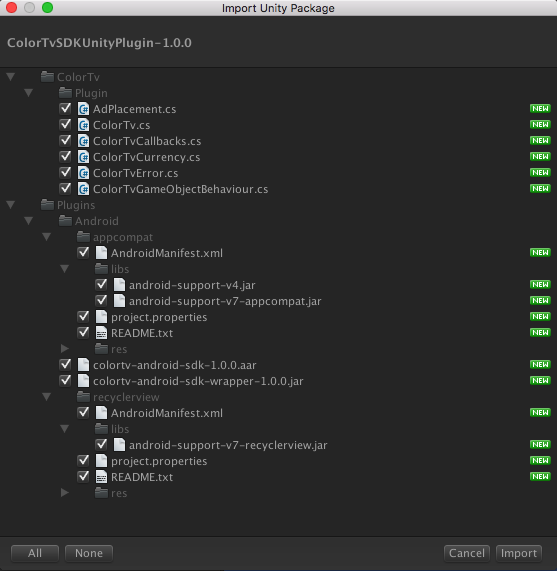

##Adding Android TV Unity Plugin

!!! note "Download Unity Plugin"
    [Download the Android TV Unity3d SDK here](https://bintray.com/colortv/unity-plugin/unity-plugin/view)

####Unpacking the unitypackage

After you download the `ColorTvSDKUnityPlugin-<version>.unitypackage`, double click it to unpack it to your project. You will be prompted with a checklist of all the files within the package:

<center></center>

!!! note ""
    You may already have the `android-support-v4`, `android-appcompat-v7` and `recyclerview` Android libraries in your project. In such case, do not import them.

After the asset import is finished, copy the `google-play-services_lib` from `ANDROID_HOME/extras/google/google_play_services/libproject/` into your unity project's `Assets/Plugins/Android/` folder.

Make sure your project has the `Minimum API Level` set to `21` or higher:

<center></center>

###Integrating the plugin to your game

To integrate our plugin into your game you first need to use the `ColorTvPlugin` namespace in every script that will invoke ColorTv SDK methods:

```csharp
using ColorTvPlugin;
```

Then you need to call the `ColorTv.Init ("AppId")` method, preferably in your game's first scene's `Start ()` method:

```csharp
void Start ()
{
    ColorTv.Init ("AppId");
}
```

You can also enable debug mode to receive more verbose logging by calling:

```csharp
ColorTv.SetDebugMode (true);
```

To get callbacks about the ad status, you need to create the following delegates:

```csharp
public void OnAdLoaded (string placementId)
{
  Debug.Log ("Ad is available for placement: " + placementId);
}
    
public void OnAdClosed (string placementId)
{
  Debug.Log ("Ad has been closed for placement: " + placementId);
}
    
public void OnError (ColorTvError error)
{
  Debug.Log ("Ad error occured for placement: " + error.PlacementId + ", with error code: " + error.ErrorCode + " and error message: " + error.ErrorMessage);
}
```

Then you need to register the delegates by using the ColorTvCallbacks class members:

```csharp
ColorTvCallbacks.AdLoaded += OnAdLoaded;
ColorTvCallbacks.AdClosed += OnAdClosed;
ColorTvCallbacks.AdError += OnError;
```

To load an ad for a certain placement, you need to call the following method:

```csharp
ColorTv.LoadAd ("ad placement");
```

It is recommended that you use one of the predefined placements that you can find in `AdPlacement` class. You can also use a custom placement.

To show an ad for a certain placement, you need to call the following method:

```csharp
ColorTv.ShowAd ("ad placement");
```

Calling this method will show an ad for the placement you pass. Make sure you get the `AdLoaded` callback first, otherwise the ad won't be ready to be played.

###Registering currency earned listener

In order to reward the user, you have to create a delegate method in one of your scripts:

```csharp
public void OnCurrencyEarnedListener (Currency coins)
{
  Debug.Log ("User has been awarded: " + coins.Amount + " x " + coins.Type);
}
```

And then register the delegate by calling:

```csharp
ColorTvCallbacks.CurrencyEarned += OnCurrencyEarnedListener;
```

Now you will be notified when the user earns virtual currency.

###Currency for user

In order to distribute currency to the same user but on other device, use below:

```csharp
ColorTv.SetUserId ("user123");
```

##User profile
 
To improve ad targeting you can use methods in ColorTv class that set the user profile.

You can set age, gender and some keywords as comma-separated values, eg. `sport,health` like so:

```csharp
ColorTv.SetUserAge(24);
ColorTv.SetUserGender(UserProfile.Gender.FEMALE);
ColorTv.SetUserKeywords("sport,health");
```

These values will automatically be saved and attached to an ad request.
